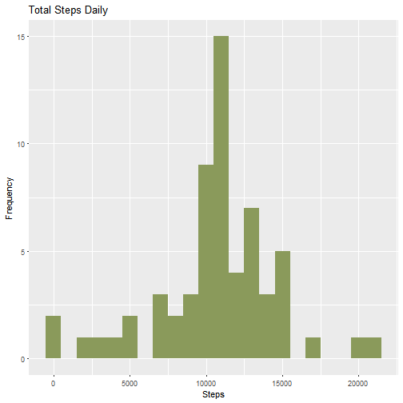

```r
library(ggplot2)
```

```
## Warning: package 'ggplot2' was built under R version 3.4.4
```

## 1 Loading and preprocessing the data

Load the data

```r
actData<-read.csv("activity.csv", header=TRUE)
```

Process/transform the data into a format suitable for analysis

```r
actData$date<-as.Date(as.character(actData$date))
actDataNA<-is.na(actData$steps)
cleanData<-actData[!actDataNA,]
```

## 2 What is mean total number of steps taken per day?

Calculate the total number of steps taken per day

```r
SummedDataByDay<-aggregate(actData$steps, by=list(actData$date), sum)
names(SummedDataByDay)[1]="date"
names(SummedDataByDay)[2]="totalsteps"
```

Histogram of total number of steps taken per day

```r
ggplot(SummedDataByDay, aes(x = totalsteps)) +
  geom_histogram(fill="#8A9A5B", binwidth=1000) +
  labs(title="Total Steps Daily", x="Steps", y="Frequency")
```

```
## Warning: Removed 8 rows containing non-finite values (stat_bin).
```


Calculate and report the mean and median of the total number of steps taken per day

```r
mean(SummedDataByDay$totalsteps,na.rm=TRUE)
```

```
## [1] 10766.19
```

```r
median(SummedDataByDay$totalsteps,na.rm=TRUE)
```

```
## [1] 10765
```

## 3 What is the average daily activity pattern?

Make a time series plot of the 5-minute interval (x-axis) and the average number of steps taken, averaged across all days (y-axis)

```r
nonNASubset<-actData[!actDataNA,]
MeanDataByInterval<-aggregate(nonNASubset$steps, by=list(nonNASubset$interval), mean)

names(MeanDataByInterval)[1]="interval"
names(MeanDataByInterval)[2]="steps"

ggplot(MeanDataByInterval, aes(x = interval, y=steps)) +
  labs(title="Mean Number of Steps by Interval", x="Interval", y="Steps")+
  geom_line(color="#8A9A5B") 
```


Which 5-minute interval, on average across all the days in the dataset, contains the maximum number of steps?

```r
(maxInterval<-MeanDataByInterval[which.max(MeanDataByInterval$steps),])
```

```
##     interval    steps
## 104      835 206.1698
```

## 4 Imputing missing values

Calculate and report the total number of missing values in the dataset

```r
(missingVals<-sum(actDataNA))
```

```
## [1] 2304
```

Devise a strategy for filling in all of the missing values in the dataset.
Create a new dataset that is equal to the original dataset but with the missing data filled in.

```r
actData2<-actData
actDataNA2<-actData2[is.na(actData2$steps),]
cleanData2<-actData2[!is.na(actData2$steps),]

MeanData2ByInterval<-aggregate(cleanData2$steps, by=list(cleanData2$interval), sum)
names(MeanData2ByInterval)[1]="interval"
names(MeanData2ByInterval)[2]="steps"

actData2<-actData
missingData<-is.na(actData2$steps)
meanVals<-tapply(cleanData$steps, cleanData$interval, mean, na.rm=TRUE, simplify=TRUE)
actData2$steps[missingData]<-meanVals[as.character(actData2$interval[missingData])]

sum(missingData)
```

```
## [1] 2304
```

```r
sum(is.na(actData2$steps))
```

```
## [1] 0
```

Make a histogram of the total number of steps taken each day

```r
FullSummedDataByDay<-aggregate(actData2$steps, by=list(actData2$date), sum)

names(FullSummedDataByDay)[1]="date"
names(FullSummedDataByDay)[2]="totalsteps"

ggplot(FullSummedDataByDay, aes(x=totalsteps)) +
  geom_histogram(fill="#8A9A5B", binwidth=1000) +
  labs(title="Total Steps Daily", x="Steps", y="Frequency")
```



Calculate and report the mean and median total number of steps taken per day.

```r
mean(FullSummedDataByDay$totalsteps)
```

```
## [1] 10766.19
```

```r
median(FullSummedDataByDay$totalsteps)
```

```
## [1] 10766.19
```

Do these values differ from the estimates from the first part of the assignment? 
Yes. It has similar mean but different median value.

What is the impact of imputing missing data on the estimates of the total daily number of steps?
The effect of using mean data per interval as a data impution method for missing values seems to approach overall data towards the mean.

## 5 Are there differences in activity patterns between weekdays and weekends?

Create a new factor variable in the dataset with two levels - "weekday" and "weekend" indicating whether a given date is a weekday or weekend day.

```r
actData2$weekday<-weekdays(actData2$date)
actData2$weekend<-ifelse(actData2$weekday=="Saturday" | actData2$weekday=="Sunday","Weekend","Weekday")
```

Make a panel plot containing a time series plot of the 5-minute interval (x-axis) and the average number of steps taken, averaged across all weekday days or weekend days (y-axis).

```r
MeanDataWeekendWeekday<-aggregate(actData2$steps, by=list(actData2$weekend, actData2$interval), mean)
names(MeanDataWeekendWeekday)[1]="weekend"
names(MeanDataWeekendWeekday)[2]="interval"
names(MeanDataWeekendWeekday)[3]="steps"

ggplot(MeanDataWeekendWeekday, aes(x=interval, y=steps, color=weekend)) +
  geom_line() +
  facet_grid(weekend ~ .) +
  labs(title="Mean Number of Steps by Interval", x="Interval", y="Steps")
```


